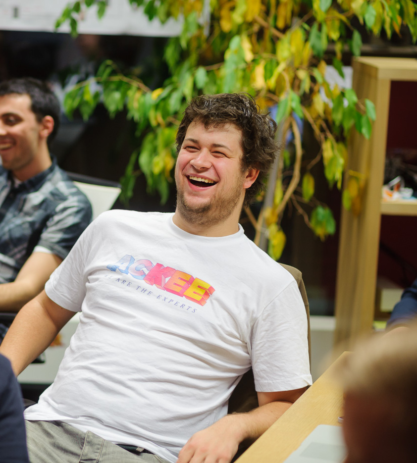
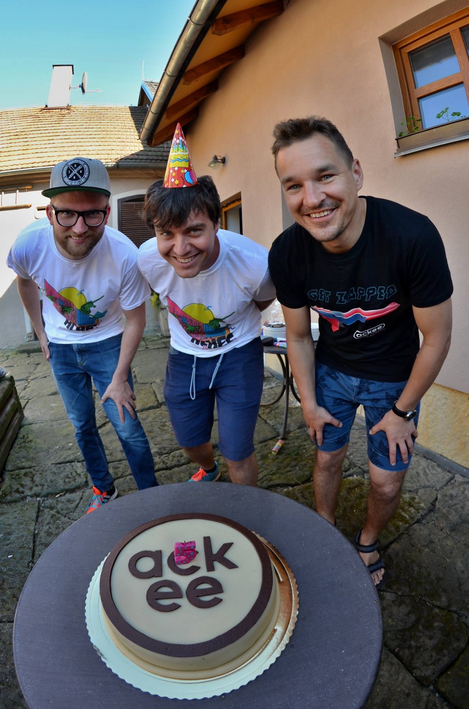

<!-- _class: lead -->

# BI-IOS

---

## Lukáš Hromadník

iOS Team Leader@Ackee

---

## Igor Rosocha

iOS Dev@Ackee

---

## Jakub Olejník

iOS Dev@Ackee

---

## WTF is Ackee?

Kompletní mobilní vývoj, backendy, weby

Since 2013

ČVUT based

---

## Co vy? 🤗

`whoami`

Ročník, Bc. / Ing.

Zkušenosti s Apple platformou

Motivace, proč jsem si to zapsal?

---

## Klasifikace

Klasika 100 bodů jako všude

2 úkoly po 20 bodech

Semestrální práce za 50 bodů

Až 10 bonusových bodů za hezké úlohy (dobrovolný úkol, nadstandarní kód / UI, vychytávky nad zadaný scope)

---

## Materiály

Formát výuky – kdo chce, naučí se mnoho, kdo ne, nenaučí se NIC

GitHub [https://github.com/AckeeEDU](https://github.com/AckeeEDU)

Přednášky ze Stanfordu

Všechny možné tutoriály – [RayWenderlich](https://raywenderlich.com)

---

## Komunikace & Helpdesk

lukas.hromadnik@ackee.cz

Slack (Teams? 😱)

---

## Vývoj pro iOS

Mobilní zařízení, předem definovaná podporovaná zařízení

Dotykový displej, senzory (gyroskop)

Odlišené UI od ostatních programů

Jednoduchý a rychlý, dokud není potřeba tvořit něco custom

watchOS, tvOS, macOS

---

## HW & SW environment

iOS jde dělat pouze na macOS

vlastní Mac > vlastní Hackintosh > virtuální macOS > učebna

macOS Monterey, Xcode 13, Swift 5.5, zkrátka všechno up-to-date

Učebna je trochu outdated, ale je to v řešení

---

<!-- _class: lead -->

## Let's get our hands dirty! :muscle:
