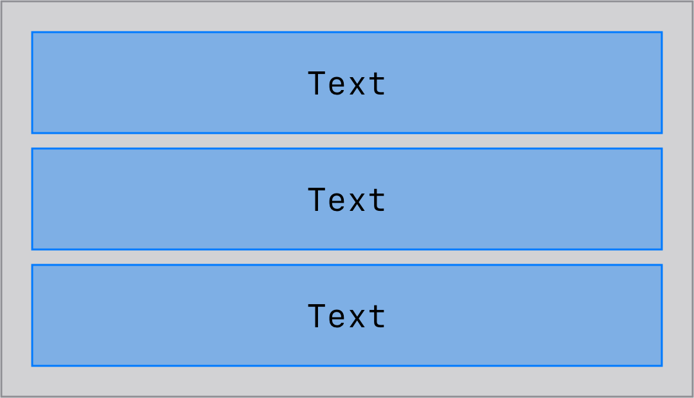
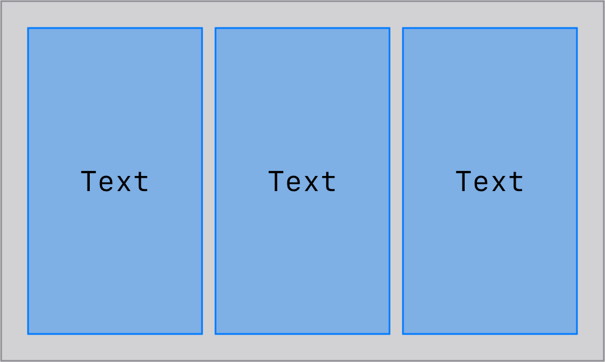
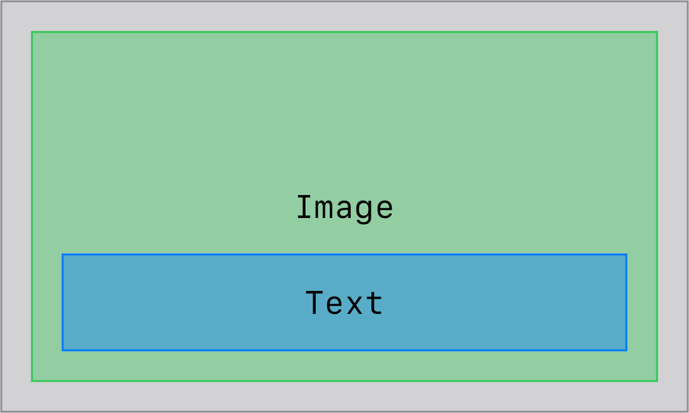
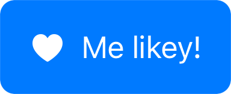

<!-- _class: lead -->

# SwiftUI

---

## SwiftUI

Deklarativní UI

Postaveno nad již existujícími UI knihovnami (UIKit / AppKit)

Jeden "jazyk" pro všechny platformy

---

## Views

Všechno je `View`

Všechno jsou to `struct`y

Postupným skládáním vzniká strom reprezentující UI

---

## `some View`

[Opaque type](https://docs.swift.org/swift-book/LanguageGuide/OpaqueTypes.html)

Resolvuje generiku - není potřeba ji vypisovat explicitně

Return type musí být pro všechny možné průchody stejný

Kompilátor ví, s jakým typem přesně pracuje

---

## `@ViewBuilder`

Mechanismus řídící skládání `View`s

Patří mezi [Result builders](https://www.avanderlee.com/swift/result-builders/)

---

<!-- _class: lead -->

## Live coding! :tada: 

---

## Otázky?

- SwiftUI
- `some View`
- `@ViewBuilder`

---

## `VStack`

Lze nastavit `alignment` a `spacing`

---

## `HStack`

Lze nastavit `alignment` a `spacing`

---

## `ZStack`

Lze nastavit pouze `alignment`, který má ale více možností

---

## `Text`

Jednoduchá reprezentace textového řetězce v UI

---

## `Button`

Skládá se ze dvou částí

- akce – co se má stát po tapnutí
- popisek – jak to má vypadat

Nezapomínat na pressed state!

Mělo by na první pohled být jasné, s čím lze interagovat

---

## `Image`

Reprezentace obrázku v UI

Obrázky jsou uloženy v Asset katalogu

Možnost využít systémových ikonek od Applu

---

## SFSymboly

Systémové ikonky od Applu

Jednoduché a hezké ikonky, které ladí s nativním systémovým stylem

Prohlížení v samostatné aplikaci

---

## Otázky?

- `VStack`, `HStack`, `ZStack`
- `Text`
- `Button`
- `Image`
- SFSymboly

---

## Vykreslování – sizing

Probíhá ve dvou fázích

### 1. Top-down

Od rodiče dostane `View` maximální možnou velikost, do které se má vykreslit

- Pokud je to list, top-down dál nepokračuje
- Pokud to není list, předá postupně svým potomkům velikost pro ně

---

## Vykreslování – sizing

Probíhá ve dvou fázích

### 2. Bottom-up

Začíná v listu, který se vykreslí do dané velikosti a svojí velikost pošle do rodiče

Rodič sesbírá velikosti svých potomků, vykreslí se a pošle velikost na svého rodiče

---

## View modifiers

Slouží k úpravě daného `View`, popř. i všech vnořených potomků

Propagují se shora dolů

Záleží na pořadí!

Aplikací view modifieru vzniká nové `View`

---

<!-- _class: lead -->

## Live coding! :tada: 

---

