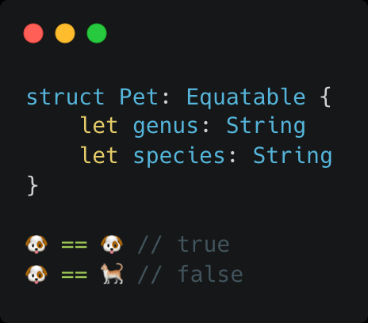
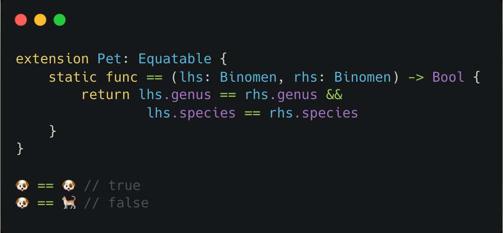
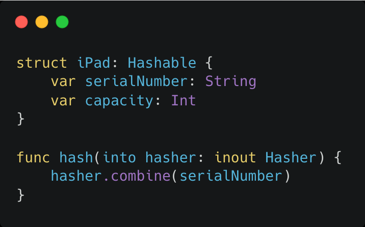
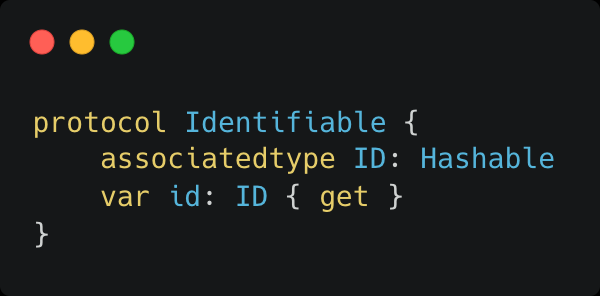
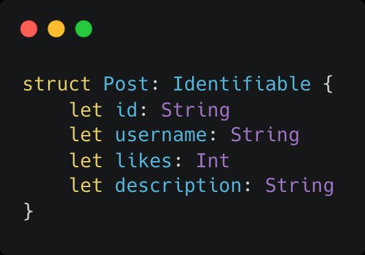
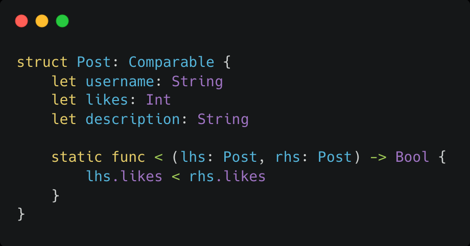

<!-- _class: lead -->

# More SwiftUI

---

## Vykreslování – sizing

Probíhá ve dvou fázích

### 1. Top-down

Od rodiče dostane `View` maximální možnou velikost, do které se má vykreslit

- Pokud je to list, top-down dál nepokračuje
- Pokud to není list, předá postupně svým potomkům velikost pro ně

---

## Vykreslování – sizing

Probíhá ve dvou fázích

### 2. Bottom-up

Začíná v listu, který se vykreslí do dané velikosti a svojí velikost pošle do rodiče

Rodič sesbírá velikosti svých potomků, vykreslí se a pošle velikost na svého rodiče

---

## View modifiers

Slouží k úpravě daného `View`, popř. i všech vnořených potomků

Propagují se shora dolů

Záleží na pořadí!

Aplikací view modifieru vzniká nové `View`

---

<!-- _class: lead -->

## Live coding! :tada: 

---

---

---

## Otázky?

---

## LazyVGrid / LazyHGrid

Grid layouts with a fair amount of flexibility

Number of GridItems specify the number of columns/rows

Columns fit the width/height of the screen, height/width is specified by the views itself

---

## ForEach

Looping over a sequence to create views

It's a view struct, which means you can return it directly from your view body

Requires identifier to identify each of the items 

---

## ScrollView

Allows to create scrolling containers of views

Automatically sizes itself to fit the content that is placed inside it

Can be either vertical or horizontal

---

## Otázky?

- LazyVGrid / LazyHGrid
- ForEach
- ScrollView

---

## Why structs?

All the views are trivial structs and are almost free to create - no other part holds the reference

Structs are simpler and faster than classes

SwiftUI encourages us to move to a more functional design approach

---

## Equatable

Values conforming to the Equatable protocol can be evaluated for equality

Compiler can automatically synthesize conformance for structures with Equatable properties

Lets a value be found in a collection and matched in a switch statement

---

## Equatable

---

## Equatable

❌ Not necessary!

---

## Hashable

In order for an object to be stored in a Set, its type must conform to Hashable (and by extension, Equatable)

Conforming is often just as easy as adding Hashable to your struct conformance

Creating own implementation is pretty straighforward (but not necessary in most cases)

---

## Hashable

---

## Identifiable

Values of types adopting the Identifiable protocol provide a stable identifier for the entities they represent

---

## Identifiable

---

## Comparable

Allows for values to be considered less than or greater than other values

You can get away with only implementing the `<` operator

---

## Comparable

---

## Otázky?

- Equatable
- Hashable
- Identifiable
- Comparable

---

## NavigationView

One of the most important components of a SwiftUI app

Allows to push and pop screens in a hierarchical way using `NavigationLink`

---

## Otázky?

