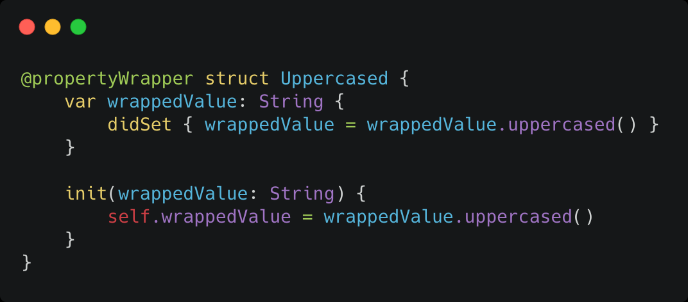
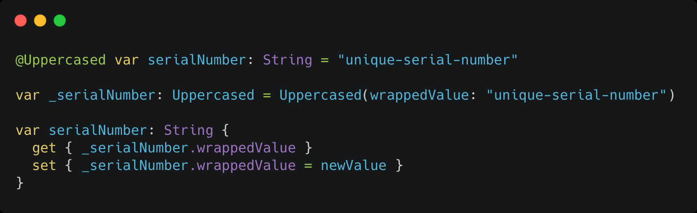
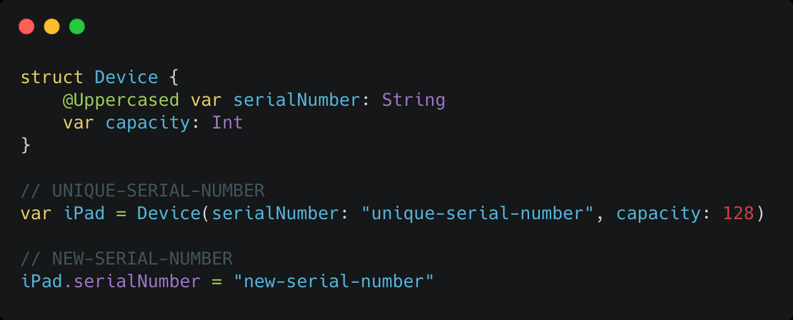

<!-- _class: lead -->

# Navigation

---

## Important shortcuts

Build: ⌘ + B

Run: ⌘ + R

Test: ⌘ + U

Stop: ⌘ + .

Clean (the build folder): ⌘ + ⇧ (+ ⌥) + K

---

## Important shortcuts

Open Quickly: ⌘ + ⇧ + O

Show/Hide Navigator: ⌘ + 0

Show/Hide Utilities: ⌘ + ⌥ + 0

Show/Hide Debug Area: ⌘ + ⇧ + Y

Show/hide completions: ctrl + Space

Show/hide preview: ⌘ + ⌥ + Enter

---

## List

A container that presents rows of data arranged in a single column

A scrollable list of data that user can interact with

Has some predefined styles and separators

Has native pull-to-refresh since iOS 15 🎉

---

<!-- _class: lead -->

## Let's code! 🤓

---

## Property wrappers

A type that wraps a given value in order to attach additional logic to it

Encapsulation of "template" behavior applied to the vars they wrap

Can be implemented using struct (or a class)

Each property wrapper type should contain a stored property called `wrappedValue`

---

## Property wrappers

---

## Property wrappers

---

## Property wrappers

---

<!-- _class: lead -->

## @State, @Binding

---

## @State

Allow us to modify values inside a struct, which would normally not be allowed because structs are value types

Effectively moves storage out from our struct and into shared storage managed by SwiftUI

Invalidates the View whenever wrappedValue changes

SwiftUI can destroy and recreate our struct whenever needed without losing the state

---

## @Binding

A value that is bound to something else (another View)

Is able to get/set the value of the wrappedValue from some other source

Invalidates the View whenever bound-to value changes

---

## @Environment

Specifically there to work with SwiftUI’s own pre-defined keys

Great for reading out fixed properties that come from the system

Presentation mode, device dark/light mode, size class, etc.

---

## Alert

When you want the user to act in response to the state of the app

Nice, native look

Not so much customizable

---

## Sheet

Used to modally present new views over existing ones

Can be dragged down to dismiss

Dismiss can be handled in multiple ways

---

## fullScreenCover

Full screen modal presentation

Cannot be dragged down to dismiss

---

## TabView

Most user-intuitive approach to separate app logic/flow

Items have their own labels and images and lead to separate screens

Has maximum of 5 items

---

<!-- _class: lead -->

## Otázky?
