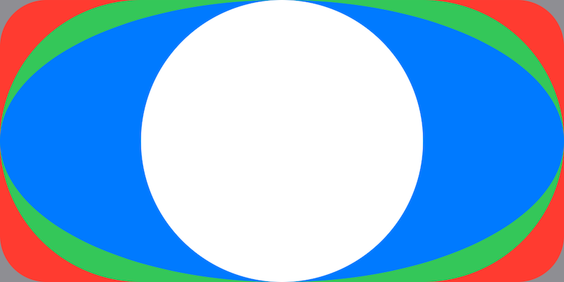
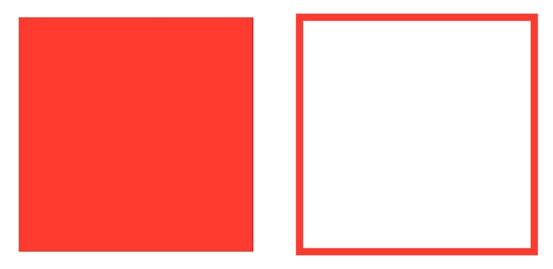
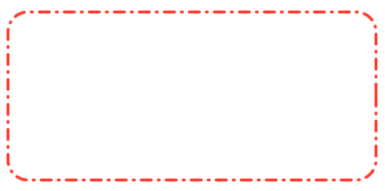

<!-- _class: lead -->

# Shapes

---

## Obsah

- Body v moodlu :tada:
- Otázky z minula?
- `Shape`
- Domácí úkol č. 2

---

## `Shape`

Definice tvarů ve SwiftUI

Lze je skládat a vytvářet tak grafiku v kódu

```swift
protocol Shape: View {
    func path(in rect: CGRect) -> Path
}
```

---

## Předdefinované tvary

`Rectangle`, `RoundedRectangle`, `Capsule`, `Ellipse`, `Circle`



---

## `Path`

Definuje "cestu" tvaru

Skládá se z částí

Cesta vždy někde začíná a někde končí

`Shape` kombinuje jednu nebo více `Path`

---

## CoreGraphics

Framework určený ke kreslení

```swift
CGFloat

CGPoint(x: CGFloat, y: CGFloat)

CGSize(width: CGFloat, height: CGFloat)

CGRect(origin: CGPoint, size: CGSize)
```

---

## `Path`

```swift
path.move(to: CGPoint)

path.addLine(to: CGPoint)

path.addArc(
    center: CGPoint,
    radius: CGFloat,
    startAngle: Angle,
    endAngle: Angle,
    clockwise: Bool
)
```

---

## `Angle`

Interní reprezentace úhlu

Spojuje jak radiány, tak úhly

Lze je přičítat a odčítat nezávisle

```swift
Angle.degrees(CGFloat)
Angle.radians(CGFloat)
```

---

## `.stroke()` a `.fill()`



---

## `StrokeStyle`

```swift
StrokeStyle(
    lineWidth: 3,
    lineCap: .round,
    lineJoin: .bevel,
    miterLimit: 0,
    dash: [10, 7, 1, 7],
    dashPhase: 0
)
```



---

<!-- _class: lead -->

## :tada: Live coding!

---

## `GeometryReader`

`View`, pomocí kterého můžete pracovat s rozměry

Vždy se roztáhne do maximální velikosti

:exclamation: Používat pokud to nejde vymyslet jinak!

```swift
GeometryReader { proxy in
    MyView()
        .frame(width: proxy.size.width / 2)
}
```

---

<!-- _class: lead -->

## :tada: Live coding!
